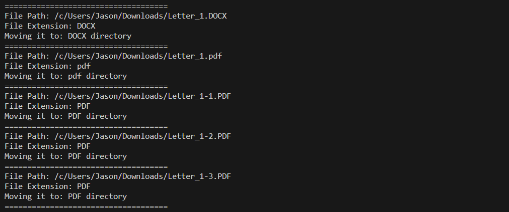

# Download Folder Organizer

### Written by Jason Spears

## Example Execution Code

./organizer.sh -p ./Downloads -m ./Misc -l ./logs -x 6

### Project Goal #1

Move files into folders sorted by file extension.

### Project Goal #2

Log file movements to a log file (-l)

## Basic Arguments

Arguments required are marked in checkboxes.

- [ ]      -h <help>: Display this information on how to use the script.
- [x]      -f <path_to_directory>: Input for the directory to be sorted.
- [ ]      -m <path_to_misc_directory>: Input for the miscellaneous directory to be sorted."
- [ ]      -l <log_file_path>: Directory for the log file output.
                                                                                                                                                                                                                  This enables logging.
- [ ]      -n <log_file_name>: Input for the name of the log file.
- [ ]      -x <misc_extension_length>: Input for the extension length to send to the Misc directory.
                                                                                                                                                                                                                  The default limit is 5.

<!-- ### Statistics

- [ ]      -s <statistics>: Echoes the following statistics:

  - [ ]      -sN = Display the number of files sorted
  - [ ]      -sS = Display the size of files moved
  - [ ]      -sQ = Display the time taken
  - [ ]      -sA = Display all statistics

  #### (All of the statistics will be shown at the end of the program and will not function if the program is closed prematurely). -->

## What I Learned From This Project:

I liked working on this project. I got to apply things I've learned in class and online to something that I find useful. Sure I had a few hiccups working on this project, but they made me do research and try things until it worked then worked to understand why it works. I learned that bash arguments are weird as they can have default values, logging from the terminal is not as easy as it should be and booleans just don't exist in bash.

## Time Spent Working On This Project:

I spent a good portion of my free time working on this project. I was given 2 weeks to work on it and started a few days into the 2 weeks. I cobbled together some barebones parts like writing a 'for loop' for every file in a directory. Then I started working on the details like allowing for logging of file movements and even thought about implementing statistics for total time, size and number of files involved from each execution of the command.

I spent well over 20 hours working on this project. I hope I did everything right and I hope it helps you if you are reading this.
